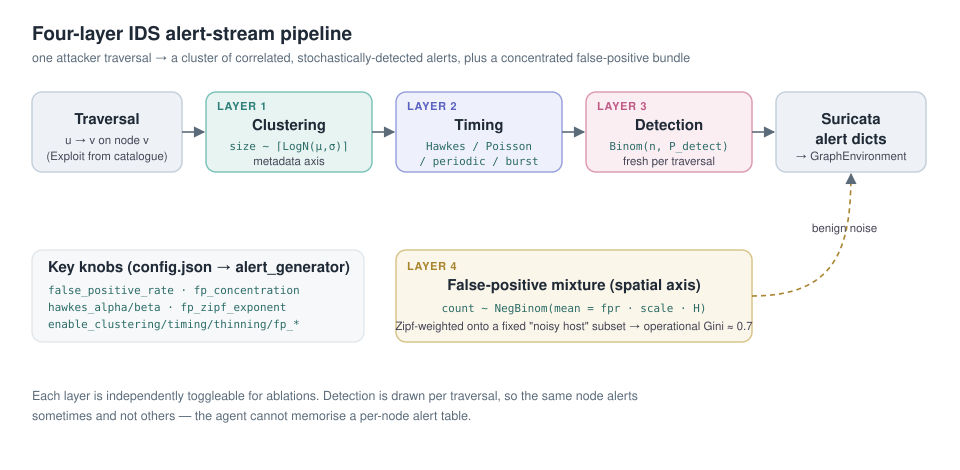

# Alert Generation — Reference

The environment ships a **four-layer generative IDS alert model**. Every time
the attacker traverses an edge `u → v`, the model emits a *cluster* of
correlated, stochastically-detected alerts for the landed node `v`, plus a
bundle of benign false positives concentrated on a small set of chronically
noisy hosts. The output is a list of Suricata-style dicts — the exact schema the
environment's downstream parser already consumes.

This document is the full reference. For a quick start see
[TUTORIAL.md §11](../TUTORIAL.md#11-configuring-alerts--the-false-positive-rate).



## Files

| File | Role |
|------|------|
| `utils/alert_generator.py` | The generator: the four layers + per-exploit timing dispatch. Depends only on `numpy`. |
| `utils/exploit_catalogue.py` | Builds a `{node_id: Exploit}` catalogue from a populated `GraphEnvironment` (maps each graph node to a technique archetype + CVSS-derived features). |
| `utils/alert_adapter.py` | `GraphAlertAdapter` — bridges the generator and the env, flattening `Alert` objects into Suricata dicts and owning the per-episode lifecycle. |
| `environment/graph_env.py` | Constructs the adapter in `__init__`, calls it once per `step()`, and re-seeds it on every reset. |

The adapter is created automatically inside `GraphEnvironment.__init__`, so any
code that builds the env (including the Gym wrappers and the training scripts)
gets the new pipeline with no extra wiring.

## The four layers

### Layer 1 — Clustering (metadata axis)

A single exploit emits a *cluster* of alerts, not one token. The raw cluster
size is

```
raw_size = ceil( LogNormal(mu_cluster, sigma_cluster) ),   raw_size >= 1
```

so the median size is `exp(mu_cluster)` and `sigma_cluster` controls the
right-tail heaviness. Per-archetype `mu_cluster`/`sigma_cluster` live in
`exploit_catalogue.py`. Toggle with `enable_clustering` (off ⇒ every cluster has
size 1).

### Layer 2 — Timing (temporal axis)

Each exploit names its own temporal model — not everything is a Hawkes process:

| Model | Inter-arrival behaviour | CV of inter-arrival times | Typical use |
|-------|-------------------------|---------------------------|-------------|
| `HAWKES` | self-exciting cascade: `λ(t) = μ + Σ_i α·e^(−β(t−tᵢ))` | CV > 1 (bursty) | port scans, scanning worms, noisy lateral movement |
| `POISSON` | memoryless, rate `r` exponential gaps | CV ≈ 1 | generic background, benign recon |
| `PERIODIC` | `t_k = t₀ + k·period + U(−jitter, jitter)` | CV < 1 (under-dispersed) | brute force, C2 beacons |
| `BURST` | one tight clump, `U(0, span)` | CV ≈ 0.6 | single-shot RCE |

The Hawkes **branching ratio** `n = α/β` must be `< 1` for the cascade to be
sub-critical (finite); the constructor enforces this. Larger `n` ⇒ burstier.
Toggle the whole layer with `enable_timing` (off ⇒ uniform timestamps within the
step).

### Layer 3 — Detection thinning (detection axis)

Each alert in a cluster survives detection with probability

```
P_detect(e) = σ( β₀ + β_av·av + β_ac·ac + β_auth·auth + β_stealth·stealth )
```

a logistic function of the exploit's CVSS/ATT&CK features, where `σ` is the
sigmoid. The number of *detected* alerts is then

```
detected_size ~ Binomial(raw_size, P_detect(e))
```

drawn **fresh on every traversal** — so the same node alerts on some visits and
is silent on others. The agent cannot memorise a per-node alert/no-alert table.

Default logistic coefficients (`AlertGenerator._DEFAULT_LOGIT`):

| coef | default | meaning |
|------|---------|---------|
| `beta0` | −1.5 | base log-odds |
| `av` | +4.0 | network-reachable exploits are louder |
| `ac` | 0.0 | complexity unused by default |
| `auth` | −1.0 | authenticated actions look like legit traffic |
| `stealth` | −3.0 | high ATT&CK stealth ⇒ mostly invisible |

A fully stealthy cluster (`raw_size > 0`, `detected_size == 0`) is flagged via
`AlertGroup.was_fully_thinned` and logged by `step()` — the "attacker advanced
invisibly" / APT signature. Toggle with `enable_thinning` (off ⇒ everything
detected).

### Layer 4 — False-positive mixture (spatial axis)

Benign false alerts are **not** spread uniformly. Per step,

```
n_fp ~ NegBinom( mean = false_positive_rate · fp_volume_scale · H,  dispersion = 2 )
```

where `H` is the number of hosts. Each FP lands on a host chosen as:

* with probability `fp_concentration` → the **noisy subset** (Zipf-weighted by
  `fp_zipf_exponent`),
* otherwise → a quiet host from the wider noise-target set.

The noisy subset has size `ceil(fp_noisy_fraction · floor(fpr · H))` and is
**fixed within an episode, re-drawn across episodes** (so noise identity is
consistent during an episode but cannot be memorised across them). This
reproduces the operational SOC regime where alert volume is heavily concentrated
(Gini ≈ 0.7–0.8). Toggle with `enable_fp_concentration` (off ⇒ uniform FP hosts,
Gini ≈ 0).

## Configuration

### The `alert_generator` block in `config.json`

This is the recommended way to configure the pipeline. The block is optional —
if absent, the defaults below apply (which reproduce the original behaviour).

```json
"alert_generator": {
  "false_positive_rate": 0.10,
  "generator_kwargs": {
    "step_duration": 1.0,
    "hawkes_mu": 0.3,
    "hawkes_alpha": 1.2,
    "hawkes_beta": 1.5,
    "fp_volume_scale": 1.0,
    "fp_concentration": 0.65,
    "fp_zipf_exponent": 1.0,
    "fp_noisy_fraction": 0.3,
    "enable_clustering": true,
    "enable_timing": true,
    "enable_thinning": true,
    "enable_fp_concentration": true
  }
}
```

`false_positive_rate` is mirrored to `env.random_noise_rate`. Everything under
`generator_kwargs` is forwarded verbatim to the `AlertGenerator` constructor.

| Key | Default | Effect |
|-----|---------|--------|
| `false_positive_rate` | 0.10 | fraction of hosts that are FP targets; scales `E[FP/step]` |
| `step_duration` | 1.0 | seconds represented by one env step (timing `t₀ = step_index · step_duration`) |
| `hawkes_mu` | 0.3 | Hawkes background intensity `μ` |
| `hawkes_alpha` | 1.2 | Hawkes excitation `α` |
| `hawkes_beta` | 1.5 | Hawkes decay `β` (need `α/β < 1`) |
| `fp_volume_scale` | 1.0 | multiplier on `E[FP/step]` independent of the rate |
| `fp_concentration` | 0.65 | P(an FP lands on the noisy subset) |
| `fp_zipf_exponent` | 1.0 | Zipf skew within the noisy subset (higher ⇒ more concentrated) |
| `fp_noisy_fraction` | 0.3 | fraction of noise-target hosts that are chronically noisy |
| `enable_clustering` | true | Layer 1 on/off |
| `enable_timing` | true | Layer 2 on/off |
| `enable_thinning` | true | Layer 3 on/off |
| `enable_fp_concentration` | true | Layer 4 concentration on/off |

You can also pass `logistic_coefficients` (a dict overriding any of
`beta0/av/ac/auth/stealth`) and `default_severity_weights` through
`generator_kwargs`.

### Setting the false-positive rate

Three equivalent entry points, in increasing order of locality:

```python
# 1. Permanent default — config.json
#    "alert_generator": { "false_positive_rate": 0.30 }

# 2. Live, on an existing env (re-derives the noisy-host subset immediately)
env.set_false_positive_rate(0.30)

# 3. Per-episode sweep from a training loop
for ep in range(num_episodes):
    env.set_false_positive_rate(schedule(ep))   # e.g. curriculum on noise
    obs = env.reset()                            # reset_episode() picks up the rate
    ...
```

`env.set_false_positive_rate(rate)` updates `env.random_noise_rate` *and* mirrors
it to the adapter, which re-draws the noisy subset. Every `reset*()` path already
calls `adapter.reset_episode()`, so the active rate is applied at each episode
boundary.

### Tuning the "feel": archetypes

Each graph node is mapped to a technique **archetype** in
`exploit_catalogue.py::DEFAULT_ARCHETYPES` (`recon`, `network_cve`, `local_cve`,
`privileges`, `host_compromise`, `unknown`). An archetype fixes the timing model,
cluster parameters, signatures, category and severity centre; CVSS-derived
`(av, ac, auth)` are layered on top per node when a CVE is present.

To change behaviour globally, edit `DEFAULT_ARCHETYPES`. To change it for a run
without editing the table, build a custom catalogue and hand it to the adapter:

```python
from utils.exploit_catalogue import build_exploit_catalogue, DEFAULT_ARCHETYPES
from utils.alert_adapter import GraphAlertAdapter

# e.g. force every recon to BURST for an ablation
arch = {k: dict(v) for k, v in DEFAULT_ARCHETYPES.items()}
arch["recon"]["timing_model"] = "burst"

catalogue = build_exploit_catalogue(env, archetypes=arch)
env.alert_adapter = GraphAlertAdapter(env, false_positive_rate=0.1,
                                      catalogue=catalogue, seed=42)
```

`build_exploit_catalogue` also accepts per-node `overrides` and an
`apt_reroute` flag (network CVEs that look APT-like — auth required + high
stealth — are re-routed from `BURST` to `POISSON`).

### Ablations

Flip any `enable_*` flag to isolate a layer's contribution:

| Flag off | Effect |
|----------|--------|
| `enable_clustering` | every cluster size 1 (no metadata-axis structure) |
| `enable_timing` | timestamps uniform within the step (no temporal signature) |
| `enable_thinning` | all alerts detected (detection no longer stochastic) |
| `enable_fp_concentration` | FPs spread uniformly (Gini ≈ 0) |

## Inspecting the pipeline at runtime

```python
env.alert_adapter.catalogue                      # {node_id: Exploit}
env.alert_adapter.detection_probability(node_id) # P_detect for that node
env.alert_adapter.noisy_hosts()                  # current episode's noisy subset
env.alert_adapter.generator.expected_fp_per_step()
env.alert_adapter.last_tp_group / last_fp_group  # last step's AlertGroups
```

Each `AlertGroup` exposes `raw_cluster_size`, `detected_size`, `timing_model`,
`signature_histogram()`, `severity_histogram()` and `was_fully_thinned`.

## Behavioural changes vs. the previous generator

* **Severity now genuinely varies 1–5** (per-archetype distributions centred on
  each node's `base_severity`), so the `z_score` and `entropy` observation
  features carry real signal instead of noise around a constant.
* **Detection is per-traversal stochastic**: the same node alerts sometimes and
  not others. Checkpoints trained against the old constant-probability generator
  will **not** transfer cleanly — retrain.
* **Stealthy exploits often produce zero alerts.** `get_valid_action_mask()`
  already falls back to Do-Nothing in that case; make sure your reward model does
  not treat that forced Do-Nothing as agent failure.

## Standalone tests

```bash
python -m utils.alert_generator      # the generator's own four-layer self-test
python -m utils.exploit_catalogue    # catalogue smoke test on a synthetic env
python -m utils.alert_adapter        # adapter smoke test
python test_integration.py           # end-to-end (from repo root)
```
